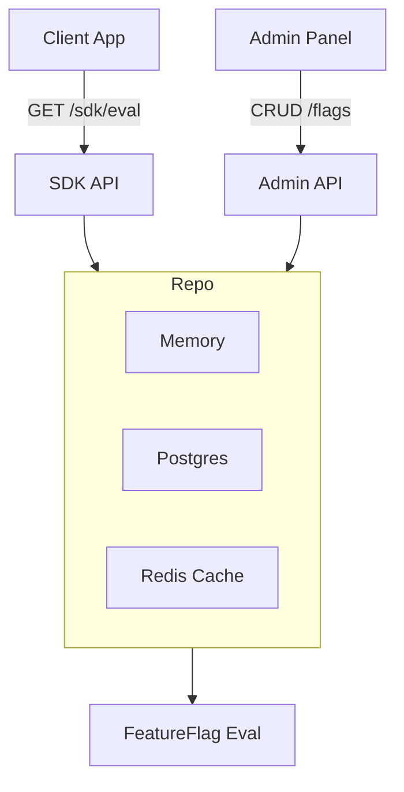

# ⚡ FFaaS – Feature Flags as a Service

FFaaS is a **feature flag management system** written in **Go**.  
It allows teams to **enable, disable, or progressively roll out features** in their applications **without redeploying code**.

This is similar in spirit to tools like **LaunchDarkly** or **Unleash**, but designed as a learning project to showcase:
- **Backend architecture in Go**
- **Clean coding practices**
- **Repository pattern with multiple storage backends**
- **DevOps-friendly design (Docker, health checks, metrics-ready)**

---

## 🎯 What Problem Does It Solve?

Deploying a new feature directly to all users can be risky.  
With **feature flags**, you can:

- **Toggle features on/off instantly** (kill switches).  
- **Gradually roll out features** (e.g., 10% of users → 50% → 100%).  
- **Run A/B tests** by exposing different cohorts of users to different flows.  
- **Separate deployment from release** → ship code continuously but release features safely.  

FFaaS provides the **APIs and logic** to manage those flags and evaluate them per user in a deterministic way.

---

## 🚀 Features

- **Admin API** → Create, list, update, and delete feature flags.  
- **SDK API** → Applications fetch and evaluate flags by `key` + `userId`.  
- **Deterministic percentage rollouts** → same user always gets the same result.  
- **Multiple backends**:
  - In-memory (for development/tests)  
  - PostgreSQL (persistent storage)  
  - Redis (cache for fast reads)  
- **Concurrency-safe** → repositories protected with `sync.RWMutex`.  
- **Ready for observability** → health checks, metrics (Prometheus-ready).  

---

## Architecture Overview

---

## Tech Stack
 - Go (net/http + chi router)
 - Storage: PostgreSQL, Redis, In-memory
 - Concurrency: sync.RWMutex, goroutines-ready
 - DevOps: Docker, Makefile
 - Testing: Go testing framework with table-driven tests

```
